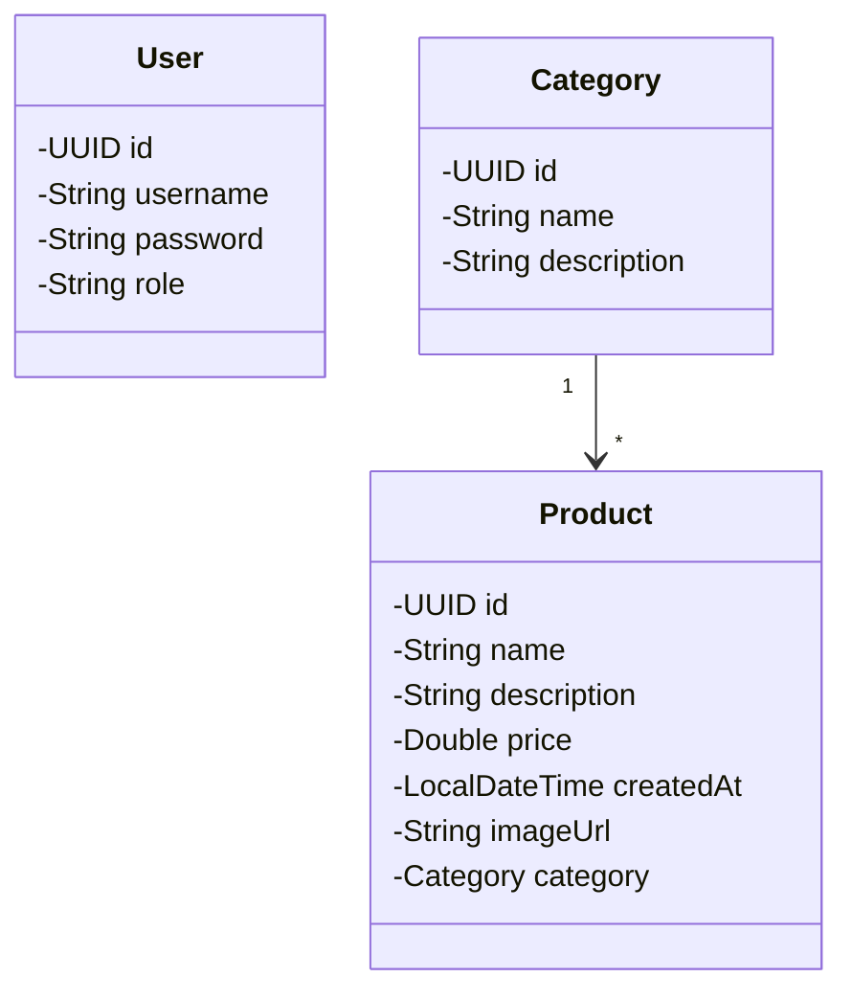
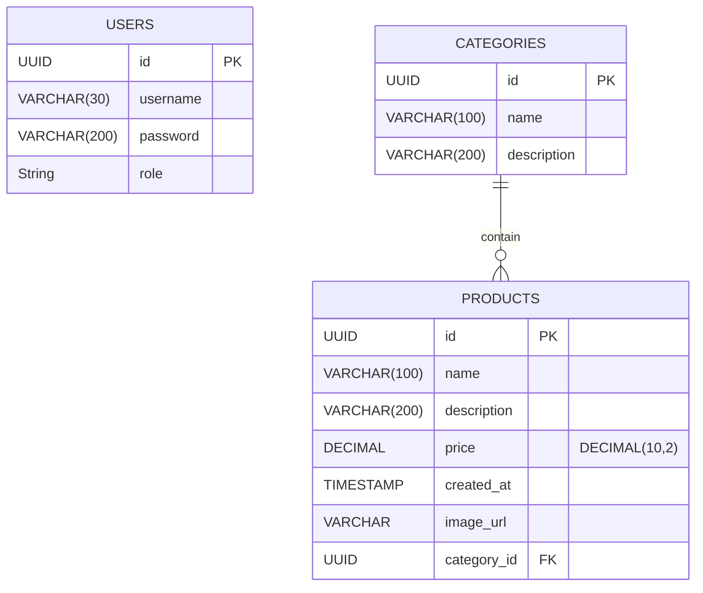

# Product catalog API


[](./LICENSE)
### Challenge
A product catalog API, which stores images in a MinIO docker using the AWS SDK for S3.
#### Features
- User authentication with login/password and JWT token generation
- User and admin registration <br/>
[ADD DETAILS HERE]
- Global exception handling with standard response format
- Full API documentation via Swagger
- Role-based authorization (ADMIN and USER)
#### Class Diagram

#### Entity Relationship Diagram

#### Package Structure
[ADD HERE]
#### Authentication and Authorization
- **Login** returns a JWT token valid for 2 hours
- Protected endpoints require the token in `Authorization: Bearer <token>`
#### Swagger Documentation
Once the application is running, access:
http://localhost:8080/docs
#### Testing
- Unit and integration tests for controllers
- Coverage of expected HTTP statuses (200, 400, 401, 403, 404, etc.)
## Running the Project
1. Clone the repository:
```bash
git clone https://github.com/samanthamaiaduarte/todo-api.git
```
2. Create a PostgreSQL database (e.g., `todoapi`)
3. Configure your database settings in `application.properties`:
```properties
spring.datasource.url=jdbc:postgresql://localhost:5432/your_db_name
spring.datasource.username=your_db_user
spring.datasource.password=your_db_password
```
4. Run the application
```bash
./mvnw spring-boot:run
```
The API will be available at http://localhost:8080
## Deployment
You can deploy this project on:
- Render.com
- Railway
- Fly.io
- Heroku (using JDK 21 buildpack)
  ⚠️ Be sure to configure environment variables like the token secret and database credentials on the platform's settings.
## Contributing
Contributions are welcome! If you find any issues or have suggestions for improvements, please open an issue or submit a pull request to the repository.
When contributing to this project, please follow the existing code style, [commit conventions](https://www.conventionalcommits.org/en/v1.0.0/), and submit your changes in a separate branch.

---
### Author
Made with ❤️ by Samantha Maia Duarte
contact@samanthamaiaduarte.com